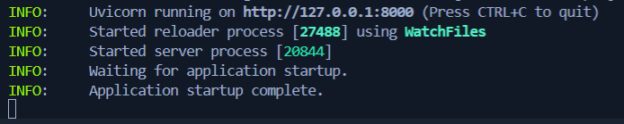

# Task Manager Backend Developer Assignment

Welcome to the Task Manager Backend Developer Assignment! This project is designed to assess your Python skills through a series of tasks that involve working with a task management system. The assignment is divided into Level 1 (easier to moderate) and Level 2 (moderate to hard) tasks, each requiring you to implement specific logic within the provided codebase.

Your objective is to complete the logic for the given tasks inside `task_logic.py` and ensure that all API endpoints work as expected. We encourage you to use best practices, write clean and efficient code, and demonstrate your problem-solving abilities.

Good luck!


## 🛠 Prerequisites

Python with environment variable PIP enabled.
[Pip documentation](https://pip.pypa.io/en/stable/installation/)


## Initial Setup

Clone the project

```bash
  git clone https://github.com/achalagarwal/storewise-backend-assignment
```
Navigate to the project directory

```bash
  cd storewise-backend-assignment
```
(If you are facing issues with navigation, checkout [this YouTube video](https://youtu.be/D1Oe7b0RaFA?si=7XZi6mmUy0bbWacj).)

Install dependencies

```bash
  pip install -r requirements.txt
```
Alternatively, you can individually ```pip install``` the packages mentioned in ```requirements.txt```.

Go to the "app" directory

```bash
  cd app
```

Start the FastAPI server

```bash
  fastapi dev
```
Alternatively, you can run the ```main.py``` file.

When the terminal shows "Application startup complete", you'll know the server is running


Visit http://localhost:8000/docs for the Swagger documentation.
(If you're using Replit, look for the Networks section where you can connect the internal port 8000 to external port 8000)

## Level 1

Easy to moderate tasks. Try to solve them sequentially, but skip forward if any question gets too intimidating.

### Question 1

Get all tasks, create a new task, and delete any task. Get familiar with the API endpoints.

#### API Reference

##### Get all tasks

```http
  GET /tasks
```

##### Create a task

```http
  POST /tasks
```
Request body JSON must include these:
| Request body |  Description                       |
| :-------- |  :-------------------------------- |
| `name` |  Name of the task |
| `description` |  Description of the task |
| `due_date` |  Deadline of the task (in [ISO format](https://www.google.com/search?q=iso+format+datetime))|
| `priority` |  Lower value indicates higher priority |
| `status` |  Current status of the task |
| `parent_id` |  ID of the parent task |
| `duration` |  Duration of the task in minutes |

Check the `models.py` file to understand the Task table better.

##### Delete a task

```http
  DELETE /tasks/${id}
```
Request body JSON must include these:
| Parameter |  Description                       |
| :-------- |  :-------------------------------- |
| `task_id` | ID of the task to be deleted |


### Question 2

Group tasks by parent_id and sort according to creation date in descending order. 

Note that you need to use the logic function in `tasks_logic.py` file, do not code in the `main.py` file.

### Question 3

Find the tasks with due date as the TODAY or TOMORROW, and Priority as 1.

### Question 4

Find parent tasks with no child tasks.

### Question 5

Count the number of task siblings (tasks with common parent dependency) of a particular task. The ID of the task is provided in the router function.


## Level 2

Moderate to hard questions

### Question 6

Implement fuzzy search, which takes an input, and returns the tasks whose names sound similar to the input.

You may use any library you like. 

### Question 7

Given 2 tasks, which is the subtask of the other. 

For example, if task A is the parent of task B, and task B is the parent of task C, then we can say that task C is a subtask of task A. 

Return NONE if they aren't related.

### Question 8

(For this question, you need to directly code in the router function in `main.py`)

Write an SQL query to find the tasks with the following criteria:
- Created beteen [26 August 2024, 9 September 2024]
- Boolean flag: Do not include tasks that have been completed
- Boolean flag: Do not include tasks created on Sunday

### Question 9

Simulate task execution asynchronously. 

The `worker_threads` variable signifies how many workers (threads) can be utilized. After that, the tasks would be performed asynchronously, and once a worker-thread is free, it can take up a new task. 

The amount of time a task requires is signified by the `duration/10` seconds (for demonstration purposes).